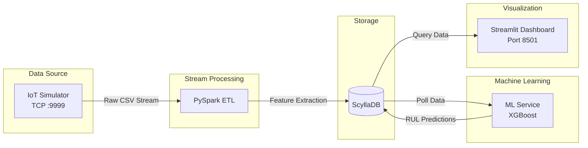

# IoT Predictive Maintenance Platform

An end-to-end predictive maintenance system for turbofan engine degradation. This project simulates real-time IoT sensor data, processes it via a streaming ETL pipeline, and predicts the Remaining Useful Life (RUL) using machine learning.

**Tech Stack:** Python, PySpark (Structured Streaming), ScyllaDB, XGBoost, Streamlit, Docker

---

## System Architecture



## Dataset & Model Performance

**Dataset:** NASA C-MAPSS Turbofan Engine Degradation Simulation (FD001)

* 100 engines (run-to-failure trajectories)
* 20,631 records, 26 features
* [Source on Kaggle](https://www.kaggle.com/datasets/bishals098/nasa-turbofan-engine-degradation-simulation)

**XGBoost Model Metrics:**

* **RMSE:** 15.47 cycles
* **MAE:** 10.44 cycles
* **R²:** 0.8625
* **Top Features:** LPT outlet temp (45.7%), HPC static pressure (20.7%), Bypass ratio (8.1%)

## Quick Start

### 1. Data Preparation

Download and format the Kaggle dataset:

```bash
pip install kagglehub
python3 preprocess_dataset.py
```

### 2. Model Training (Offline)

Train the model to generate the required scaler and `.pkl` files:

```bash
pip install -r ml_training/requirements.txt
python3 ml_training/train_rul_model.py
```

### 3. Launch Infrastructure

Start the containerized services. It is recommended to bring up the database and Spark cluster before initiating the data streams:

```bash
# 1. Initialize database and schemas
docker compose up -d scylladb 
docker compose up scylla-init

# 2. Start Spark cluster
docker compose up -d spark-master spark-worker

# 3. Start data generation, ETL, inference, and UI
docker compose up -d iot-simulator spark-etl ml-service dashboard
```

### 4. Access Interfaces

* **Streamlit Dashboard:** `http://localhost:8501`
* **Spark Master UI:** `http://localhost:8080`
* **Spark Worker UI:** `http://localhost:8081`

## Database Schema (ScyllaDB)

The system utilizes three tables. All tables use `PRIMARY KEY (machine_id, cycle)` with `CLUSTERING ORDER BY (cycle DESC)`.

1. `sensor_readings`: Raw sensor data ingested by Spark ETL.
2. `sensor_features`: Rolling features computed for inference.
3. `rul_predictions`: Model outputs (RUL value, health status, timestamp).

## Repository Structure

```text
.
├── benchmarks/               # Throughput and latency measurement scripts
├── dashboard/                # Streamlit web application
├── init_db/                  # ScyllaDB CQL schema definitions
├── iot_simulator/            # Python TCP socket data streamer
├── ml_service/               # Continuous prediction polling service
├── ml_training/              # Offline XGBoost training scripts
├── spark_etl/                # PySpark Structured Streaming jobs
├── docker-compose.yml        # Orchestration for all 8 services
└── preprocess_dataset.py     # Data standardization script
```

## Operations

**Benchmarking:**

```bash
pip install cassandra-driver numpy
python3 benchmarks/throughput_test.py
```

**Teardown:**

```bash
docker compose down -v
```

## License

MIT
